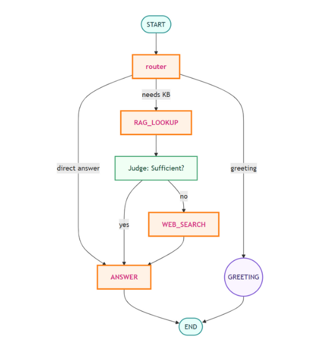

# LangGraph RAG Agent

## Overview

**LangGraph RAG Agent** is an agentic Retrieval-Augmented Generation (RAG) system built using LangGraph. It routes user queries through a knowledge base lookup, fallback web search, and direct answers, following a configurable flow:

  

This single-file Python implementation orchestrates the entire pipeline stages in one script.

## Features

* **Router**: Classifies inputs into greeting vs. knowledge lookup.
* **RAG Lookup**: Retrieves relevant context from a local or remote knowledge base.
* **Sufficiency Judge**: Determines if retrieved KB context adequately answers the query.
* **Web Search**: Falls back to real-time web searches when KB context is insufficient.
* **Answer Composition**: Builds final responses by merging context and LLM outputs.
* **Greeting Handler**: Detects and replies to simple salutations gracefully.

## Prerequisites

* Python 3.8+
* Install required packages:

  ```bash
  pip install -r requirements.txt
  ```

## Installation

1. Clone this repository:

   ```bash
   git clone https://github.com/your_org/agentic-rag.git
   cd agentic-rag
   ```
2. Set your environment variables:


## Flow Explanation

1. **Routing**: Input is first checked for greeting keywords (`hi`, `hello`, etc.).
2. **RAG Lookup**: If not a greeting, the agent queries the configured KB (e.g., a FAISS vector store).
3. **Judge Sufficiency**: A lightweight LLM classifier determines if retrieved context suffices.
4. **Web Search**: On insufficiency, the agent issues a web search via the `web.run` tool.
5. **Answer**: The agent composes the final answer from KB or search results.
6. **End**: Conversational loop ends or returns to router for next input.

Refer to the diagram for a visual representation of this flow.